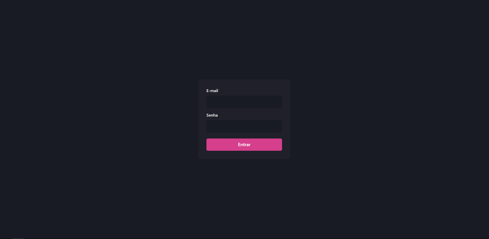
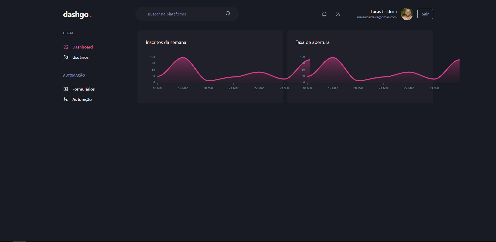
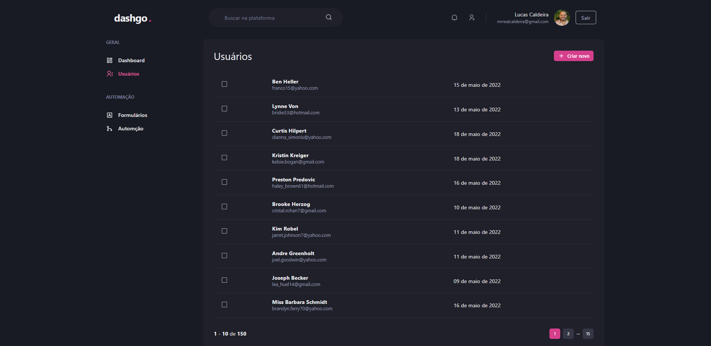

<h1><strong>dashgo.</strong></h1>

 
 
<strong><h2>🎯 Sobre</h2></strong>

A proposta desse desenvolvimento consiste na implementação de sistema web que tenha tela de login, dashboard e uma com paginação.

 
 <strong><h2>🛠️ Tecnologias usadas</h2></strong>

[- <strong>NextJS</strong>](https://nextjs.org/)

[- <strong>TypeScript</strong>](https://www.typescriptlang.org/)

 
<strong><h2>⚙️ Instalação</h2> </strong>

<strong>🔙 Pré-requisito </strong>

Antes de começar, você precisará ter instalado em seu computadore as seguintes ferramentas: [Git](https://git-scm.com/) , [Node.js](https://nodejs.org/en/) e [Yarn](https://yarnpkg.com/) .
Além disso, é bom ter um editor para trabalhar com seu código, como o [VSCode](https://code.visualstudio.com/).

Você precisa seguir os passos desse repositório https://github.com/realcaldeira/dashgo-backend, pois ele que contém o backend da aplicação.

 

<strong>🔽 Clonando o repositório </strong>

<pre>via HTTPS
$ git clone https://github.com/realcaldeira/dashboard-chakra.git </pre>

<strong>🖥️ Iniciando o aplicativo</strong>

<pre>
# Acesse a pasta com comando <strong>cd </strong> 

# Volte para a pasta anterior do aplicativo 
$ cd ..

# Instale as dependências
$ yarn

# Inicie a API - https://github.com/realcaldeira/dashgo-backend

# Inicie o projeto
$ yarn dev
o projeto roda na porta: http://localhost:3000

Este projeto foi feito com ❤ por Lucas Caldeira
